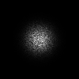
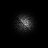

# modellingAndSimulation
Master repository for modelling and simulation based projects including:
- Computational fluid dynamics solver
- Magnetic atom trap generator
- Laser atom trap model (Magneto-optical trap)
- Ray tracing and interaction with objects

# Computational fluid dynamics solver in Python 2.7
Programme which simulates the evolution of fluids, given some initial conditions. Based on OpenFOAM, a C++ CFD library.

## Prerequisites
Python 2.7 with NumPy, SciPy and Matplotlib installed.

## How it works
- The user specifies initial conditions for the fluid density, velocity and temperature in the ```scripts``` folder.
- Specify the timestep (must be small enough for numerical stability) and the plotting preferences.
- The solver does the rest!
- Plots and images are saved in the ```outputs``` folder (automatically generated).

## Examples
A Kelvin-Helmholtz instability is a well-studied phenomena which occurs when there is shear (different velocities) at the surface of a fluid (or fluid region). Even with the smallest perturbation in the fluids surface, the perturbation will grow - initially exponentially but, when large enough, non-linear effects cause over-turning circulations which form tidal-wave-like feautures. (Indeed this is the exact instability which forms waves in the sea, when the wind speed is different from the speed of the water in the ocean, as well as at the edges of clouds).

<b>Initial conditions</b> (small perturbation at interface):


<b>After 10,000 timesteps</b> (perturbations are growing):


<b>After 50,000 timesteps</b> (non-linear overturning begins):


<b>After 100,000 timesteps</b> (approaching equilibrium):


# Ray Tracing in Python 2.7
Programme which simulates classical photons and their interaction with surfaces, in order to produce images.

## Prerequisites
Python 2.7 with NumPy, SciPy and Matplotlib installed.

## How it works
- The user specifies a light source using the 'ray' object.
- The user defines surfaces using the 'surface' object using three coordinates and a reflectivity.
- The user defines a screen where the photon intersection with each pixel is counted

## Examples
The current test cases involve a laser-pointer directed vertically-downwards, with a mirror at 45 degrees and a screen/receiver which is stood vertically:
```
                    LASER |_____|
                             |
                             |
SCREEN                       |
||                           | /
||                           |/
||---------------------------/ MIRROR
||                          /
||                         /

```
All surfaces are currently made of a triangular mesh. So a square mirror seen face-on will look like two triangular mirrors put together:
```
-----------
|\        |
|  \      |
|    \    |
|      \  |
|        \|
-----------
```

[Example using two identical mirrors (the same reflectivity) and 100,000 photons.](rayTracing/bin/readme/rayTraced_twoMirrorsIdentical.png)



[Example using two mirrors with different reflectivities and 100,000 photons.](rayTracing/bin/readme/rayTraced_twoMirrorsDifferent.png)



## Roadmap
- [x] Create proof of concept.
- [ ] Create objects which automatically build a triangular mesh.
- [ ] Add roughness parameters to surfaces


# Magnetic atom trap generator in Python 2.7
Programme which randomly generated microscopic wire configurations which are capable of trapping neutral atoms (via the Zeeman effect) when an external magnetic field is applied. Applications for quantum computers and rotation sensors.


